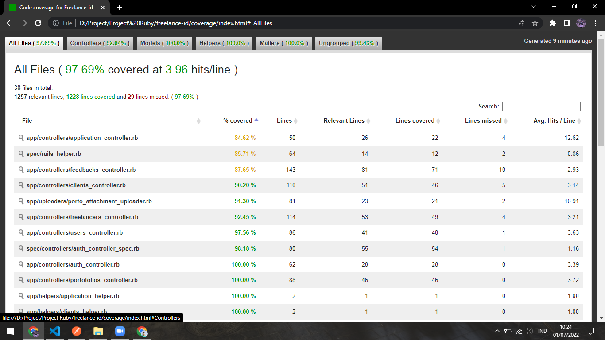
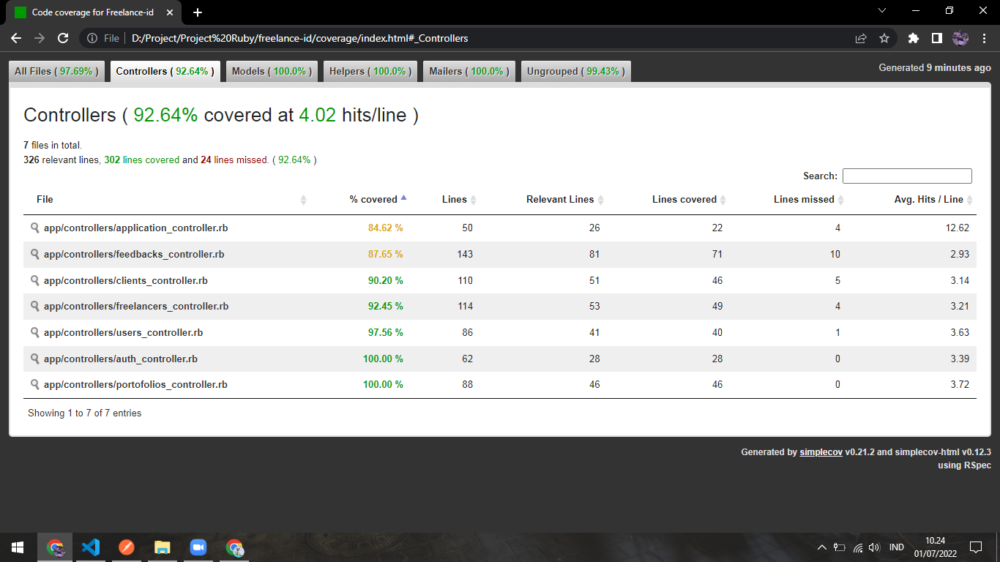
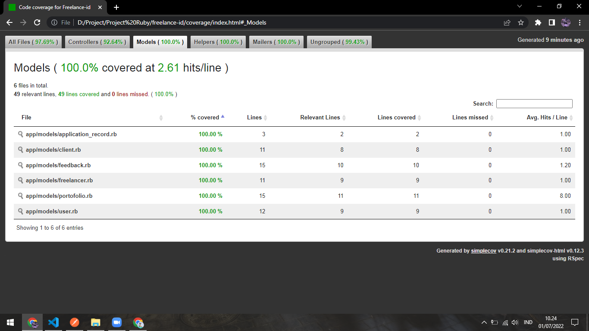
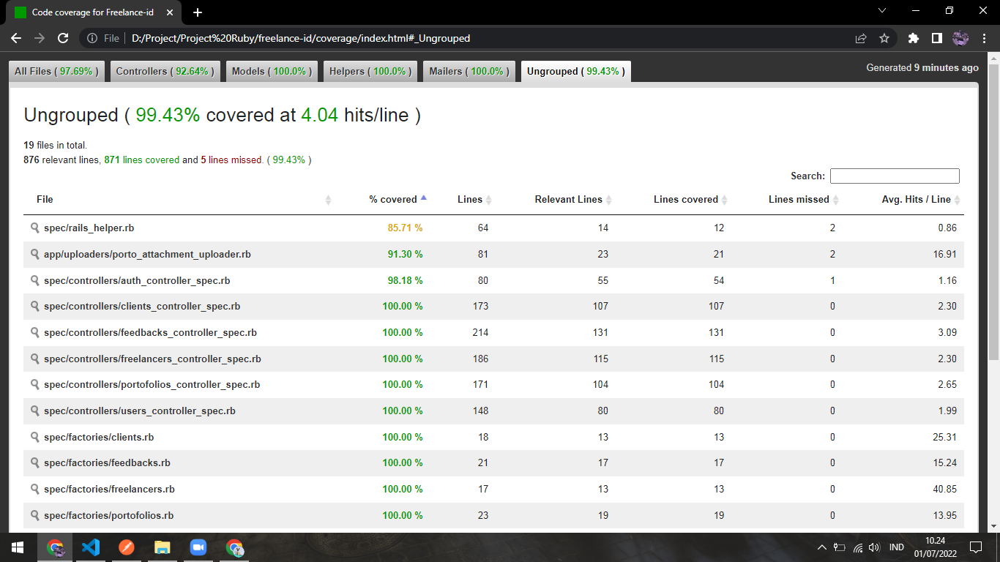

# Freelance ID


## Description

According to the Central Statistics Agency, the unemployment rate for the last 3 years (2018 - 2020) can be categorized as bad because every year there is an increase in the number of unemployed in Indonesia if it is calculated from groups that do not have a business or a fixed income at all. The unemployment rate in 2018 was 4.27%. Then in 2019 there was a decrease to 3.61%. Unfortunately, the condition of the decline in 2019 was inconsistent, where in 2020 it experienced a drastic increase to 5.75%. It is known that one of the factors that caused the increase in the percentage was due to the COVID-19 pandemic.

As a result of the COVID-19 pandemic, many activities that were previously done in person can now be done online. The choice to work freelance recently also shows a significant increasing trend. The main consideration that is most often encountered behind the choice of working independently is the freedom/flexibility to manage time and being able to work anywhere and anytime (borderless). In addition, freelance work, which tends to pay more attention to skills (skills) than educational qualifications, is a separate consideration for why the freelancer profession is increasingly in demand. The surge in contract jobs using the services of freelancers in a very large number is known as the gig-economy. Seeing this phenomenon, Freelance ID is here as a digital solution for Indonesia, especially in dealing with the high interest in working freelance.

Freelance.id is a digital solution that focuses on people in Indonesia who have not found work. Freelance.id is a website-based application with the concept of one of which only displays freelancer portfolios and testimonials for later consideration by clients. This concept is promoted because most people who have not worked have a low profile background, but that person has the ability to do something. In that section Freelance.id is a differentiator from other products.

## Feature

Basically the features provided are oriented towards users who will use this application, here are its features:

| No. | Feature Name | Description |
|-----|--------------|-------------|
|1.|All Client| This feature is a feature that is intended for guests when they first access the application which is useful for displaying information on all clients on Freelance ID. |
|2.|All Freelancer| This feature is a feature that is intended for guests when they first access the application which is useful for displaying information on all freelancers on Freelance ID. It includes additional features, namely viewing portfolios and viewing testimonials. |
|3.|Sign In|This feature is a feature that is intended to enter the application, either acting as a freelancer or a client. |
|4.|Sign Up|This feature is a feature for registering a new account on the application where you can register as a freelancer or client.|
|5.|Edit Profile|[Authorized] This feature is a feature for editing profile information in the form of name, phone number, date of birth, and work category.|
|6.|Change Password|[Authorized] This feature is a feature to change the password of an account.|
|7.|Delete Account|[Authorized] This feature is a feature to delete an account.|
|8.|Rating|[Authorized] This feature is a feature intended for freelancers to see their rating while using the Freelance ID application.|
|9.|Portofolio|[Authorized] This feature is a feature intended for freelancers who can add new portfolios, edit portfolios, and delete portfolios.|
|10.|Feedback|[Authorized] This feature is a feature intended for clients where you can add new feedback, edit feedback, and delete feedback.|
|11.|Job Offer|[Authorized] This feature is a feature intended for clients but this feature has not been realized|

## Activity Process

Basically this application is built as simple as possible and easy to use by users. The process scenarios that the user might do:

### Guest

1. Visiting the app for the first time
2. View all clients registered in the application
3. View all freelancers registered with the app
    - View one of the freelancer portfolios
    - See one of the testimonials owned by freelancers
### Freelancer

1. Visiting the app for the first time
2. Register as a freelancer
3. Login
4. Complete profile information
5. View profile information
    - Editing profile
    - View account info
    - Change password
    - Deleting account
6. Doing logout
7. View ratings
8. View all portfolio
    - View a portfolio
    - Adding a new portfolio
    - Editing portfolio
    - Delete portfolio
9. See feedback from clients

### Client

1. Visiting the app for the first time
2. Register as a client
3. Login
4. Complete profile information
5. View profile information
    - Editing profile
    - View account info
    - Change password
    - Deleting account
6. Doing logout
7. See all the feedback that has been given
    - See one of the feedback
    - Adding new feedback
    - Editing feedback
    - Delete feedback
8. [Coming Soon] View all job offers made
    - View one of the job offers
    - Adding a new job offer
    - Edit job offer
    - Remove job offer

---

## Detail Documentation

You can read the detail documentation to know more about `database schema`, `relation between entity`, `role access`, `how to use application with postman` (include there's a payload, and example request also response), `how to use application with User Interface`.

- [Indonesia Documentation](https://drive.google.com/file/d/1CAuxJ6P9Ven7vPmMhaRfepGhMNQYfAkm/view?usp=sharing)
- [English Documentation]()

---

## How To Install

### Clone Repo

The first step you have to clone the github repository to your local with the following command

```bash
git clone https://github.com/adityatriand/freelance-id.git
```

### Check Ruby & Rails

Make sure you have installed ruby and rails locally and have the same version as this [Check Version](https://docs.google.com/document/d/125WKcsJtWttuuOqGtL0IngiJNDIJ1RPxBthUX-SKQeM/edit?usp=sharing)

### Setup Gemfile

Make sure you have the same list of gems as this [Check Gemfile](https://docs.google.com/document/d/125WKcsJtWttuuOqGtL0IngiJNDIJ1RPxBthUX-SKQeM/edit?usp=sharing)

### Run This Command

After previous steps has been done, run this command sequentially

```bash
bundle install
```
```bash
rails db:migrate
```
```bash
rails db:migrate RAILS_ENV=test
```

After that your setup has been done, last you can run Freelance ID with this command on your local

```bash
rails server
```

---

## Result Unit Test

Unit tests are created with simplecov and run with rspec. The results obtained are 97.69% covered. here are the details:









---

## Demo Application

### Postman
To see a demo of the application using Postman, please click

[Postman Demo](https://youtu.be/a17hs9-8jyE)

### With User Interface
To see a demo of the application using User Interface, please click

[UI Demo](https://youtu.be/GhJfFuSuNjM)